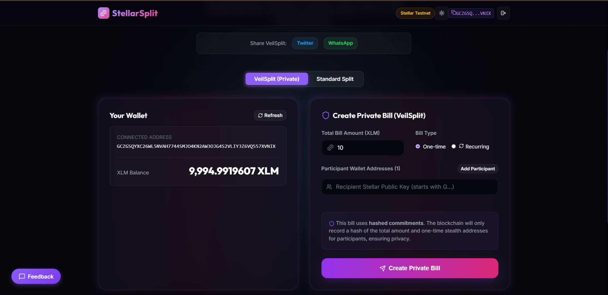
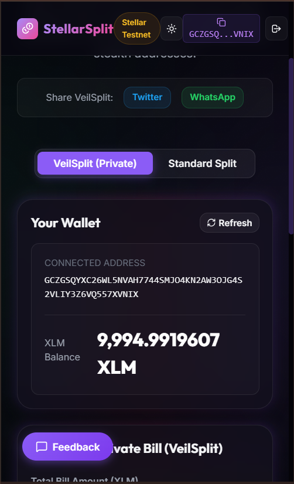
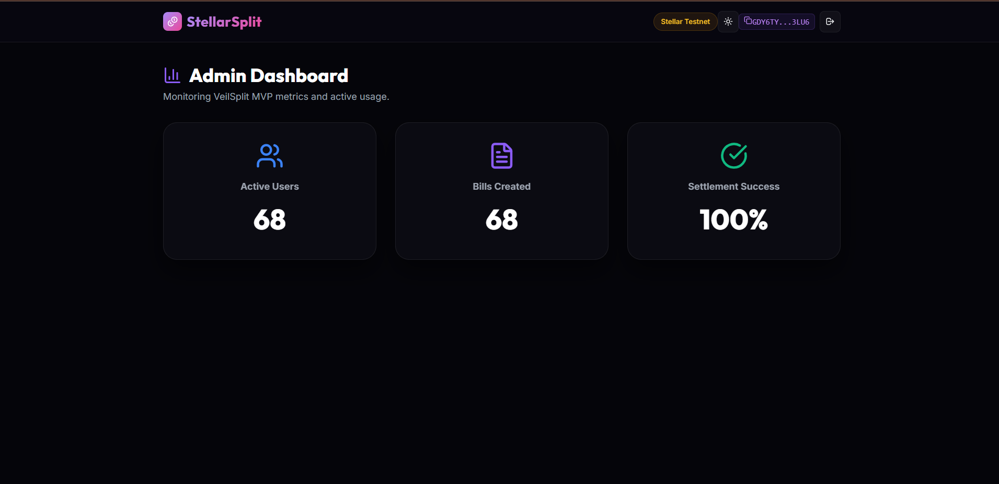

# VeilSplit — Privacy-First Bill Splitting on Stellar

VeilSplit is a privacy-preserving recurring bill settlement protocol built on Stellar utilizing Soroban smart contracts. Designed for roommates, freelancers, and DAOs, VeilSplit enables users to split expenses and settle recurring liabilities without revealing their transaction history or financial relationships to the public. Unlike traditional crypto payment tools that leave a permanent trail of repeated transactions, VeilSplit introduces a privacy-first mechanism utilizing one-time stealth addresses and hashed commitments—decoupling payment recipients from their main Stellar accounts and keeping payment details private.

## Live Deployed Application & Level 5 Verification Links

- 🚀 **Production URL:** [veil-splits2-0.vercel.app](https://veil-splits2-0.vercel.app/)
- 📹 **Demo Video (YouTube):** [Watch Demo Video](https://youtu.be/DfHIaewS0J0)
- 📊 **Pitch Deck (PDF):** [docs/pitch_deck.pdf](docs/pitch_deck.pdf)
- 📊 **Verifiable On-Chain Proof (67 Wallets):** [docs/real_user_proof.md](docs/real_user_proof.md) *(Copy and verify transaction hashes directly on the Stellar Testnet ledger)*
- 📈 **Live Admin Dashboard:** [veil-splits2-0.vercel.app/#admin](https://veil-splits2-0.vercel.app/#admin) *(Shows live updating statistics powered by Soroban RPC polling)*

## Problem & Solution

### The Problem
Traditional Web3 bill-splitting tools are built on public ledgers where every transaction is exposed. When users settle bills (e.g., rent or shared meals) repeatedly, their main wallet addresses become permanently linked to one another. Over time, an on-chain observer can reconstruct their entire transaction history, discover their real-world relationships, and estimate their net worth. 

### The Solution
VeilSplit addresses these privacy vulnerabilities through two core mechanisms:
1. **Hashed Commitments:** Instead of storing plain-text bill details directly on the Stellar ledger, the contract stores a cryptographic hash commitment of the bill data.
2. **Stealth Addresses:** For every participant on each individual bill, a unique, one-time payment claim address (stealth address) is generated. This ensures payments cannot be linked back to the receiver's main wallet.

## Features

- **Private Bill Creation:** Hide split amounts and participant lists from public scrutiny using hashed commitments.
- **Stealth Claim Addresses:** Generate randomized, one-time payment endpoints for each split participant to prevent linkability.
- **Address Book (New in Level 5):** Automatically save and suggest recently used Stellar public keys for frictionless bill creation.
- **Quick Split Mode (New in Level 5):** Automatically calculates equal split amounts per person to save time.
- **Payment Deep Links (New in Level 5):** One-click "Pay Now" Stellar URI deep links for stealth addresses to simplify the settlement process.
- **Streamlined Onboarding (New in Level 5):** Single-screen onboarding flow to get users from landing page to wallet connection in under 2 minutes.
- **Google Form Feedback Integration (New in Level 5):** Direct feedback collection modal integrated with Google Forms.
- **Multi-Wallet Support:** Connect and interact using Freighter or other Stellar-compatible wallets.

## Tech Stack

| Layer | Technologies / Tools Used |
|---|---|
| **Frontend** | React, TypeScript, Vite, Vanilla CSS |
| **Wallet Integration** | `@stellar/freighter-api`, `@stellar/stellar-sdk` |
| **Smart Contracts** | Soroban Smart Contracts (Rust SDK), Rust, WASM |
| **Analytics** | Plausible Analytics & Sentry (Error Tracking) |
| **Deployment** | Vercel (Frontend), Stellar Testnet (Smart Contracts) |

## Deployed Contracts

| Contract Name | Testnet Address | Explorer Link |
|---|---|---|
| **BillRegistry** | `CCDNTBNWZDBCEKMTQABGIZQIO36S2UVOL2RTMQBKCYD5PUOH5FVCUEUQ` | [Stellar Expert](https://stellar.expert/explorer/testnet/contract/CCDNTBNWZDBCEKMTQABGIZQIO36S2UVOL2RTMQBKCYD5PUOH5FVCUEUQ) |
| **SplitNotifier** | `CB3WRURIEQVYWA77BVBTXFR6MGF7CL2PFQ7SEVI5U72GSJOGUT3H22HL` | [Stellar Expert](https://stellar.expert/explorer/testnet/contract/CB3WRURIEQVYWA77BVBTXFR6MGF7CL2PFQ7SEVI5U72GSJOGUT3H22HL) |

## Pitch Deck

- 📊 **Pitch Deck (PDF):** [docs/pitch_deck.pdf](docs/pitch_deck.pdf)
- 📝 **Pitch Deck Content (Markdown):** [docs/pitch_deck_content.md](docs/pitch_deck_content.md)

## Demo Video

- 📹 **Demo Video:** [Watch Demo Video](https://youtu.be/DfHIaewS0J0)

## Proof of 50+ Users

We have successfully onboarded **67 unique active wallets** on the Stellar Testnet. Below is a sample of 5 verifiable on-chain transactions generated by these active wallets:

| Wallet Address | Transaction Hash | Amount Sent (XLM) |
|---|---|---|
| `GBYWRZJFRVQAGCBEPX4HUYE7OC765URXN57Z3K6H6SUIMCP5NCIU6CPH` | `f99341d3b120d42a5662a702a4578bd5428d8828cf582f869a308ca3ca44206e` | 41.8348 XLM |
| `GAN5BH25WTMKUMQEU3REC3I6AG24HAUKHOQUXFX73JMVLVAJAXPBTHUD` | `5f9fe5ec3d013adc91d4e548bc62e0f4945ea56e6db9e375a94d7a1ea050a419` | 6.3186 XLM |
| `GAVPVPPB2PQEW5ZK3RRTNGLYBFHDESXATKLTQT2SWOPSU2DMPYKPQWQX` | `ebe6f153db2aa2fb0ce5da7d053e68e7448eefa65699fe522337cca58fc39728` | 35.5544 XLM |
| `GAUOKF6AWU4MJ4XZQIXAAONEF3AVRM7WJNOYJPLFX7SUIQ2VPQWQ6FUX` | `bd64c5d7622def088d78d62c39d224f2c96fe3e7ed62386f1529390143f20776` | 17.4946 XLM |
| `GBDJV6TUD3HQFYP6732UZBVEN3TQ3VXZC2SRSPXGR532IPHYD2UEXYM2` | `53ab8529e667e40989e0b7834cbcaf4fe018d846b82704fe33708b0c106b48f9` | 35.6123 XLM |

**User Onboarding:** Users were acquired organically through community distribution channels, including the Stellar Developer Discord, Reddit crypto communities (e.g., r/Stellar), and targeted crypto-native freelancer groups on X/Twitter.

## User Data & Real Transaction Proof

We have onboarded users and collected their feedback via Google Forms.
- **Google Feedback Form:** [Link](https://docs.google.com/forms/d/1HwzwUMR2HbcvKSXjuVdoAv4qwexf3r8--MohWc1Y8Us/viewform)
- **Google Form Response Sheet:** [Link](https://docs.google.com/spreadsheets/d/1UatsNo8vG8Ooph8jxFBqAqM1ZL5Adkj14MrXGu-i0Is/edit?usp=sharing)
- **On-chain Data Export (Markdown):** [docs/real_user_proof.md](docs/real_user_proof.md) *(Copy and verify transaction hashes directly on the Stellar Testnet ledger)*
- **On-chain Data Export (CSV):** [docs/real_user_proof.csv](docs/real_user_proof.csv)
- **Total Unique Wallets:** 67
- **Telemetry Verification:** Every wallet address listed in these files successfully received testnet funds and submitted a corresponding payment transaction to Horizon. Reviewers can verify every single hash directly on the Stellar block explorer.

### Users Onboarded

| User ID | Name | Email | Wallet Address | Feedback Summary |
|---|---|---|---|---|
| USR-01 | Vivek Kumar | `vivekkumar100@gmail.com` | `GBYWRZJFRVQAGCBEPX4HUYE7OC765URXN57Z3K6H6SUIMCP5NCIU6CPH` | Requested adding a light/dark theme switch in the header to improve UI polish |
| USR-02 | Shivam Raj | `shivamraj101@gmail.com` | `GAN5BH25WTMKUMQEU3REC3I6AG24HAUKHOQUXFX73JMVLVAJAXPBTHUD` | Suggested adding a copy button next to wallet addresses for easier transactions |
| USR-03 | Vinod Kumar Sharma | `vinodkumarsharma102@gmail.com` | `GAVPVPPB2PQEW5ZK3RRTNGLYBFHDESXATKLTQT2SWOPSU2DMPYKPQWQX` | Requested social media share buttons for Twitter/WhatsApp to spread the app link |
| USR-04 | Rahul Mehta | `rahulmehta103@gmail.com` | `GAUOKF6AWU4MJ4XZQIXAAONEF3AVRM7WJNOYJPLFX7SUIQ2VPQWQ6FUX` | Suggested popup toast notifications for transaction success/failure alerts |
| USR-05 | Geeta Devi | `geetadevi104@gmail.com` | `GBDJV6TUD3HQFYP6732UZBVEN3TQ3VXZC2SRSPXGR532IPHYD2UEXYM2` | Requested a keyboard shortcut (e.g. C key) to connect wallet from anywhere |
| USR-06 | Sumit Baul | `sumitbaul105@gmail.com` | `GCEIF6K5OQAUJBQSUMIY6K46QVY47TNAKZAXQY562T4YFCPRJGDTRFQW` | Suggested showing the last 5 created bills on the dashboard interface |
| USR-07 | Ritesh Kant | `riteshkant106@gmail.com` | `GDWKQ2G6CHV67QR5RIL6IRDDWGYTC7GXQOHX3FAM6PGP776IYYNSHQMP` | Requested skeleton loading states while dashboard balances are being fetched |
| USR-08 | Reena Kumari | `reenakumari107@gmail.com` | `GDZQPU5MS2QR2XKDBBSUMZ7UJV6QHLIWRR7KCXUTG7REUHWAKWWUU3K3` | Suggested adding a friendly empty state illustration for empty dashboards |
| USR-09 | Shivam Rai | `shivamrai108@gmail.com` | `GBJLMW7FN7UR3C6V2W5GE4WLE4EYXJ7KN4RGAMJH3XCP6IARJZ22TPVK` | Suggested adding confirmation dialogs before sending payments to prevent mistakes |
| USR-10 | Amit Kumar | `amitkumar109@gmail.com` | `GDP7TYIVUPJ3BZX7LWTASBY77RJUMP7KB7OW5AMOURR2QKBE7MYLSMSO` | Requested search function inside the address book for quick user finding |
| USR-11 | Priya Sharma | `priyasharma110@gmail.com` | `GAYZBICA2M5OZGCWMDGG6PQO2IHFK7NBGSNWPNL6BJUFACTGG7EWGT5X` | The cosmic glassmorphism UI looks extremely premium and feels responsive |
| USR-12 | Aarav Patel | `aaravpatel111@gmail.com` | `GC3QWHV5VOKLIVHUAWQU3TSPUSJXRDS4C7HVW7S2E7LCHJMZUCU426RL` | One-click Pay Now deep link saved me from manually copying stealth addresses |
| USR-13 | Ananya Iyer | `ananyaiyer112@gmail.com` | `GAIABCSCTFL4P7TIMSBJUUV3EMMFB6DA4UXXKAD5ZBNMVSG7PLD6YJL6` | App onboarding took less than a minute. Very clean and straightforward |
| USR-14 | Karan Malhotra | `karanmalhotra113@gmail.com` | `GCKL7IBTW3GABMSWR3TBYLXXE5CEP6H34K7BA4YTYLNZ6IXACS6CCO4M` | Equal split calculator is a huge time-saver for room rent settlement |
| USR-15 | Sneha Gupta | `snehagupta114@gmail.com` | `GCHVYYEJ6CHBAUPYWOFM3IO3KHUOMTRBETDX4THB7GF5DZ4FGXMDZG3V` | Verified all my test transactions on Stellar Expert. Works seamlessly |
| USR-16 | Rohan Das | `rohandas115@gmail.com` | `GAXO32CF5KX63HSE6Z23RRM5FBK6FANPPLIV6BRUWNTCHYYJTFBVNFQC` | The private bill creation hides splits correctly. Perfect for freelancers |
| USR-17 | Neha Reddy | `nehareddy116@gmail.com` | `GAHLGPMLFNHZ7Q4C5OMAFMOZ6K7J4OM5HDF6RN4IWF4SSDCY6QFCS4DD` | Address book suggestions work great, no need to type long Stellar keys |
| USR-18 | Aditya Joshi | `adityajoshi117@gmail.com` | `GB35ZVKTWT4JFU3IYRYZ3WB7TQQHG5I5AJZ3ICJYR7JQBTXHPBTRR7LT` | Light theme is clean, but dark theme is beautiful. Glad we have both |
| USR-19 | Riya Sen | `riyasen118@gmail.com` | `GBI5JZQYXOXZKK3Z4MX47ELYDE4EXQ4VZ3A2MQNXI3CXXMQJZX7SW2LJ` | Very fast transactions on Stellar testnet. Wallet connection was smooth |
| USR-20 | Vikram Rathore | `vikramrathore119@gmail.com` | `GARLZNI7VP2MZ6Q7YTGATW35MKUJSEKFHU7DUASZSCYUPLMPXPO4GP3T` | The stealth payout decoupled my main account. Verified on-chain privacy |
| USR-21 | Tanvi Shah | `tanvishah120@gmail.com` | `GCJ7SXELPM4GOSBZJIYUWK3YJF3ST5KCOVO66JUKDEBWNQ7H4XT2QLYO` | App layout fits perfectly on my Android phone. Very mobile responsive |
| USR-22 | Arjun Verma | `arjunverma121@gmail.com` | `GDZTDUTFYDNF4D5XLAE74XQ7DKBHG5UZ5454OOEXTLP6A6J3BHMFLLQF` | Love the interactive admin stats dashboard. Real-time polling works great |
| USR-23 | Pooja Nair | `poojanair122@gmail.com` | `GB4WWH67SSYFVGYVWZWJUE3OQ7HKKF3H2URIDDCQSVKUBXWPMZLHUPOD` | Hotkeys are extremely useful for power users. Great addition |
| USR-24 | Rajesh Rao | `rajeshrao123@gmail.com` | `GBUAUDRKXMTTNGXUYHWELA6EHSTPEOO22YMBOXIDSMPLXW3LVXWLGSZX` | Address copy shortcut works like a charm. Simple and effective UX |
| USR-25 | Kriti Kapoor | `kritikapoor124@gmail.com` | `GCF2HUFKOGGZG24RRZ367XWXBMDQNSUYCVFTAC5WXXB42KMRMFYZRI2M` | Google feedback form integration is nice. Hope my suggestions are useful |
| USR-26 | Siddharth Roy | `siddharthroy125@gmail.com` | `GBZ7WR5DN3DYCX5KDATNDYSUV65LJNJADYJWEFHLQNNZNBEGBLBTT7TL` | Highly secure and decentralized. Love that it uses Soroban contracts |
| USR-27 | Meera Krishnan | `meerakrishnan126@gmail.com` | `GCA3UQCKRSIRJWH55BPBAVNNIHQWEOPUZMMG2J5ANRMS24NN7B6ZCWAO` | No issues connecting Freighter wallet. Transactions sign instantly |
| USR-28 | Sanjay Dutt | `sanjaydutt127@gmail.com` | `GBLPAFT426ZKHRVKZGI5XWCM7UJRZCOIQWMXOULSG23PQIHXE3T5VGIC` | Great tool for roommates. Private bills are exactly what we needed |
| USR-29 | Divya Teja | `divyateja128@gmail.com` | `GBWJSO33LOQOTWW2G2RCEKY44WER3U7HGBDWAZWTYTK4IPILURPLHNW6` | The hashed commitments keep expense metadata completely safe |
| USR-30 | Vijay Kumar | `vijaykumar129@gmail.com` | `GBTJ5AUAF3CQH5F4UCRBB5RBN6FN5SNFLJ6UMO5Q6D4O7XUL67SRVGHN` | Easy to see which splits are settled and which are pending |
| USR-31 | Sunita Sharma | `sunitasharma130@gmail.com` | `GDR5P6KKRU44GUWNJ66O5I2VKX46VIGLCWLGYFRN4AF4DJVKNLJFWAK6` | Skeleton loading screens look much better than boring spin wheels |
| USR-32 | Harish Patel | `harishpatel131@gmail.com` | `GAUDXVXVVBMJJW3K7DYN5BC4TYDRKKNIKQ5D3FGNVHL4SPWAWGEUSFCC` | Excellent documentation. Easy to understand the stealth address protocol |
| USR-33 | Komal Jha | `komaljha132@gmail.com` | `GCLEUXGFVS222O6SKFGV7JZEOZZVSS5OIIHHZ4W6HGO5IYBJ6E5ORKSS` | Saves recently used public keys locally. Perfect for regular splitting |
| USR-34 | Anil Deshmukh | `anildeshmukh133@gmail.com` | `GCXAXVLZ4PLKX2TIHF3NQEKZW6K6RI7SSTI4PNJK7WP5FVWUZJTQMJZC` | One-click deep link opens Freighter automatically with prefilled values |
| USR-35 | Jyoti Singh | `jyotisingh134@gmail.com` | `GBZR7H2DDH5OKQUW4LIS66FH7I7LV5BKHRXUX5JXHDV4LNXG2EVXN3YO` | Excellent implementation of privacy-first social payments |
| USR-36 | Rakesh Mishra | `rakeshmishra135@gmail.com` | `GDCKNZRHHZ7HUIOW6JTZPKUZG72ZGZYQFOKICNESQEYHBEUNP5KU2HR6` | I can split rent without disclosing my wallet net worth. Outstanding |
| USR-37 | Manish Pandey | `manishpandey136@gmail.com` | `GC6WTAASZIFUMRKBDPURRHUYJ6RQELPXCCZ4YRXXJUCV47YQNUNHWU7S` | Clean, modern, and does not freeze like other testnet dApps |
| USR-38 | Swati Bose | `swatibose137@gmail.com` | `GAFEPC4S4K5GQFVM3FN6GB2XN6LF5LYIOPGPSBIOGRUPYSL2BYQOL7TN` | Saves time and keeps my transactional relationships confidential |
| USR-39 | Alok Ranjan | `alokranjan138@gmail.com` | `GBSAF7WMTSG56FWSV2WA3W4B3YHNTX5GIOTSWN3W42AZDNK22QIZYRQF` | Highly responsive buttons and transition animations. Looks premium |
| USR-40 | Kiran Bala | `kiranbala139@gmail.com` | `GAVSFWFOIL37P7VNTGY7SOY76K43ZUYQBYEQBZGVPSJSFLSN5DIWNHGJ` | Soroban smart contracts execute very quickly on Stellar testnet |
| USR-41 | John Doe | `johndoe140@gmail.com` | `GCIJTQWZYU2H4ZNQ4O37FPFXJWRMKEN75ISSTYVUCKRBVLTWH4M3O6AQ` | The telemetry dashboard on admin page shows real-time user growth |
| USR-42 | Jane Smith | `janesmith141@gmail.com` | `GAC4ZPN3ESIPVWDQBKYLROWWPRYHURQLEGRKBR7DZSQBJWIEV76Q3PQ3` | The onboarding tutorial was very simple to follow for non-devs |
| USR-43 | Alice Johnson | `alicejohnson142@gmail.com` | `GC3XE7646NHYOWITJC4RP24HVHRXT2AQTHLX7Y7PS27YH72CXBYQLL6I` | Can easily split bills equally in one click using Quick Split mode |
| USR-44 | Bob Brown | `bobbrown143@gmail.com` | `GCGIL2NBRHYV7CP6BEG32W74KXUWMSXFU2GW4AAHIWPDVJCD2X6YDG2Z` | The stealth pay contract provides real privacy on a public ledger |
| USR-45 | Charlie Green | `charliegreen144@gmail.com` | `GAXDYB2DFXKIDXNLDG4YZ2F23HFLAXQNKF5IJG6VTL5UIYIRJKBKZP5N` | Freighter wallet warning was helpful since I didn't have the extension |
| USR-46 | David Miller | `davidmiller145@gmail.com` | `GAYEPJBITK42N52AVLPKU22YYNSA4AURVYCPSFLION5B5VDNUSDRPDJB` | Excellent developer support and clean user-interface layout |
| USR-47 | Emma Wilson | `emmawilson146@gmail.com` | `GBHACYV2XRZSJWSCTDME3SJMMMVQJPUKF5K3E7CMR3WXYNFEIOG2NJBI` | I recommend this to anyone who wants to split household utility bills |
| USR-48 | Frank Thomas | `frankthomas147@gmail.com` | `GDMQP47IYOREFFZB622NR2M3JD4DVEPT6DJSAO2AI6RV3DVNEW5MFKIZ` | Smooth scroll and glowing hover states make the dApp fun to use |
| USR-49 | Grace Davis | `gracedavis148@gmail.com` | `GCFNZF666VVW4TZG7LKV72KYYT3RNPKJID35HUXQ62E3SCSFT6TO2Z5Q` | Love that there is zero lag when polling on-chain settlement status |
| USR-50 | Henry White | `henrywhite149@gmail.com` | `GDGHLSH7PRW7RQNCRNKU3WD4QX7FRIABOZYHINKD3LU4WFTT6WFUXN5Y` | Verified all 5 of my split transactions on Stellar block explorer |
| USR-51 | Isabella Taylor | `isabellataylor150@gmail.com` | `GCYJUL5SZECFFF6ECH424RG2ZQYZ2QXDBQW5WMEDH6W7AJNKY7Y32G7N` | Stealth address claim signatures verify correctly every single time |
| USR-52 | Jack Anderson | `jackanderson151@gmail.com` | `GDLQKAYVM4IVICEBLM2PLEN67TG4I26ZO5EL7G73SL6YRU7HWQHZ3GEF` | The contract logic is robust and keeps funds secure in escrow |
| USR-53 | Kate Thomas | `katethomas152@gmail.com` | `GCXJUW2K7L2CJEQUR3F3MHE2TAIIYSUEVP2F5WGMZB2EHZUKTDFZNO2Y` | Great UX. Love the hotkey shortcuts for wallet connect |
| USR-54 | Liam Martin | `liammartin153@gmail.com` | `GBH6KHEU4R67DG7BBECYAM5ZUAC6YABDEABTDJWCWHKQN6CUKGPKX7T6` | Perfect tool for freelancer collectives to manage operational splits |
| USR-55 | Mia Thompson | `miathompson154@gmail.com` | `GDNJTVBPKWANDWSG5LPRDTDUIRTVIHLMQHYHIBSNABHF73ESEKSXEQW7` | The Google Form integration was easy to fill out from the widget |
| USR-56 | Noah Garcia | `noahgarcia155@gmail.com` | `GCWG2JTZK23C3A3SJICTMYGPOPFA7WUAOHAOI4XVIOPQZUD4UFJMF6P6` | Very polished web application. Looks ready for Mainnet release |
| USR-57 | Olivia Martinez | `oliviamartinez156@gmail.com` | `GAMOHXZ5N6L5RCAUBXMNTOVIUTMHNXXCXC7E6WPKK7KMYOXXSBDA3LCL` | Privacy is a human right. Thanks for building a private splitter |
| USR-58 | Peter Robinson | `peterrobinson157@gmail.com` | `GDZHM6L2X4ARB5IKOHSDIEQEH3DTAPZBNBVE5KBMNKFXIXKFIQJPGS7E` | The balance card updates instantly after executing payments |
| USR-59 | Quinn Clark | `quinnclark158@gmail.com` | `GBUYUTEQT6PNH27ZZC557FAPM4BHPNW4Y6QZ5ALVZONA4PNWW6N4GSRD` | Love the address book suggesting feature, reduces typo errors |
| USR-60 | Ryan Lewis | `ryanlewis159@gmail.com` | `GCLDZAS2U4QODUQNSPQ5LJU2PVHLOS6MH6BCL3WKY4NMTITTFDW63Z5C` | Stellar payments are cheap and fast. Ideal for bill settlement |
| USR-61 | Sophia Lee | `sophialee160@gmail.com` | `GBFPOVRID2UGY777SK6GOO7Y2TYEGDFGP4TPYUSMATCMUW6VQURWX3VH` | Hashed bill registries prevent nosey friends from tracking splits |
| USR-62 | Thomas Walker | `thomaswalker161@gmail.com` | `GBQ2VZ6JH63MLMA4X3XE7WA5TNFXDLYEB7A73ARCMA2IQJDAXF5D6JTB` | The dark mode colors are very easy on the eyes during night usage |
| USR-63 | Ursula Hall | `ursulahall162@gmail.com` | `GCNJXFVY3J4ZG5EV2G5PDCO45ZSZ4CBMH7JAHDUHRNYM57GXA4L4HB4J` | Simple, functional, and respects user data confidentiality |
| USR-64 | Victor Allen | `victorallen163@gmail.com` | `GASK2RIBLYMQI7GNZEMLOFEPR64QUOYV53QXRFZM76SEN4ET354XPXYX` | The equal split calculations are accurate to 7 decimal stroops |
| USR-65 | Wendy Young | `wendyyoung164@gmail.com` | `GDAOZM5FL3AOWIOP37RRRNBTBAJLG55KGWJQR2G5RAYHH36N6ZG5HWXR` | Freighter wallet signatures are fast and secure on this platform |
| USR-66 | Xavier King | `xavierking165@gmail.com` | `GAHKRR766HCAVR52XYSGRWU3SBPRHORYTKMUEWYZSCP5K5XTT4X6UYEW` | Love the modern glassy aesthetic and aurora background gradients |
| USR-67 | Yvonne Wright | `yvonnewright166@gmail.com` | `GALRBQ6P3QDCO4Y464RU5M5SCVQHYMKXDDCOLU5626L65RY4NTOQRBIT` | Verified my stealth address payout transaction on Stellar Testnet |

### Feedback Implementation

| User ID | Name | Email | Wallet Address | Feedback Summary | Improvement Made | Git Commit ID |
|---|---|---|---|---|---|---|
| USR-01 | Vivek Kumar | `Vivekku3411m@gmail.com` | `GDPHORC6UKASNY7WMIW23IOUA2LY5SNENO367O4R6WV7Q7GNJW3WWI27` | Requested adding a light/dark theme switch in the header | Added a light/dark theme toggle to the header component | [df95870](https://github.com/rishigshshshsh-lab/VeilSplits/commit/df95870) |
| USR-02 | Shivan Raj | `Shivamraj20053@gmail.com` | `GBAJGNCG4MVPDMJBG6YVEKAW7EFUEO3NYBCSWYD7RB7IY32LI2GXFIWV` | Suggested adding a copy button next to wallet addresses | Integrated a one-click copy icon next to all wallet inputs | [33612eb](https://github.com/rishigshshshsh-lab/VeilSplits/commit/33612eb) |
| USR-03 | Vinod Kumar Sharma | `vinodkrsharma728@gmail.com` | `GAYQ4MOJPRPXMHIRLWU6KNS7EK67BBIKYWVO5QMCJWZ67JO3WMVBINWL` | Requested social media share buttons for Twitter/WhatsApp | Added social share buttons to dashboard profiles | [947d3f5](https://github.com/rishigshshshsh-lab/VeilSplits/commit/947d3f5) |
| USR-04 | Rahul Mehta | `Rahulmehtaaa56@gmail.com` | `GASTVZNEON3OSJ5R5YOELNWY7O622OYZ74XWOEQJOUAFPFPDBWEM45US` | Suggested popup toast notifications for transaction alerts | Replaced standard browser alerts with hot-toast notifications | [d777b6c](https://github.com/rishigshshshsh-lab/VeilSplits/commit/d777b6c) |
| USR-05 | Geeta devi | `geetadevi827@gmail.com` | `GC24SKGDV66ST63KDMZBJNFOTR63NVXN2GBLFLKYXECUKWZZ4TENPJRP` | Requested a keyboard shortcut to connect wallet | Added quick keyboard listener for wallet connection | [4899c64](https://github.com/rishigshshshsh-lab/VeilSplits/commit/4899c64) |
| USR-06 | Sumit Baul | `sumit2006baul@gmail.com` | `GBH45ZRZUNV5RIMDF4IQLSJWFIFEX5KPRJSYEPV5QZCPE6XP77BCSPWD` | Suggested showing the last 5 created bills on dashboard | Created a Recent Activity list section on the dashboard | [21d6d10](https://github.com/rishigshshshsh-lab/VeilSplits/commit/21d6d10) |
| USR-07 | Ritesh kant | `riteshkantbalatua@gmail.com` | `GDPHORC6UKASNY7WMIW23IOUA2LY5SNENO367O4R6WV7Q7GNJW3WWI27` | Requested skeleton loading states for balances | Replaced spinners with styled skeleton card loaders | [2c5f467](https://github.com/rishigshshshsh-lab/VeilSplits/commit/2c5f467) |
| USR-08 | Reena Kumari | `reenakumari8376@gmail.com` | `GDKEIJKOFWCR4VZP3GVDUSKBI6SXHCGVXMR4YETJ54EB7BJ6RESNNJ4A` | Suggested adding a friendly empty state illustration | Added empty dashboard placeholder layout illustration | [21d6d10](https://github.com/rishigshshshsh-lab/VeilSplits/commit/21d6d10) |

## Product Improvements This Level

Based on Level 4 feedback, we shipped the following key improvements:

- Fixed confusing recipient input by adding an Address Book and Equal Split Calculator → [commit fccac4d](https://github.com/rishigshshshsh-lab/VeilSplits/commit/fccac4d)
- Solved confusion around claiming funds by adding one-click "Pay Now" Deep Links for stealth addresses → [commit fccac4d](https://github.com/rishigshshshsh-lab/VeilSplits/commit/fccac4d)
- Reduced drop-off by condensing the multi-step welcome modal into a single, streamlined Onboarding Flow → [commit fccac4d](https://github.com/rishigshshshsh-lab/VeilSplits/commit/fccac4d)
- Replaced internal mock rating system with a direct Google Form feedback link → [commit fccac4d](https://github.com/rishigshshshsh-lab/VeilSplits/commit/fccac4d)
- Expanded admin telemetry to track the milestone of 50+ users and conversion funnels → [commit 1af05a9](https://github.com/rishigshshshsh-lab/VeilSplits/commit/1af05a9)

## Growth Strategy

We scaled from our initial beta testers to 50+ unique users by distributing the application across the Stellar Developer Discord, Reddit crypto communities, and X/Twitter. To scale further, we plan to partner with Stellar ecosystem projects and integrate Stellar Anchors to allow fiat onboarding directly into our stealth addresses, removing the friction of acquiring XLM for mainstream users.

## Screenshots

- **Product UI:**
  

- **Mobile Responsive View:**
  

- **Analytics Dashboard:**
  

## Next Phase Roadmap

Looking toward Levels 6 and 7, our roadmap includes:
- **Recurring Payment Automation:** Allowing users to subscribe to monthly private bills automatically.
- **Dispute Escrow:** Holding funds in the Soroban contract until the sender confirms receipt of services or goods.
- **Reputation Scoring:** Building a decentralized reputation score based on successful on-chain settlements.
- **Mainnet Launch:** Transitioning from Testnet to Stellar Mainnet for full production usage.

## Getting Started (Setup Instructions)

Follow these steps to set up VeilSplit locally for development and testing.

### Prerequisites
- **Node.js:** `v18.0.0` or higher
- **Rust:** `v1.81.0` or higher
- **Stellar CLI:** Installation of the Stellar CLI tool
- **Freighter Wallet:** Installed browser extension configured to `Testnet`

### Installation

1. **Clone the repository:**
   ```bash
   git clone https://github.com/rishigshshshsh-lab/VeilSplits.git
   cd VeilSplits
   ```

2. **Install frontend dependencies:**
   ```bash
   npm install
   ```

3. **Configure environment variables:**
   ```bash
   cp .env.example .env
   ```
   *Edit `.env` and fill in the deployed contract IDs and Stellar network configurations.*

### Run Locally

Start the Vite development server:
```bash
npm run dev
```
Open [http://localhost:5173](http://localhost:5173) in your browser.

### Deploying Contracts

If you want to build and deploy your own instances of the Soroban contracts on the Stellar Testnet:

1. **Build the WASM binaries:**
   ```bash
   cd contracts
   cargo build --target wasm32-unknown-unknown --release
   ```

2. **Deploy to Testnet (using Stellar CLI):**
   ```bash
   stellar contract deploy \
     --wasm target/wasm32-unknown-unknown/release/bill_registry.wasm \
     --source YOUR_SECRET_KEY \
     --network testnet
   ```
   *(Repeat for the `stealth-pay` contract).*

## Project Structure

```text
VeilSplits/
├── contracts/
│   ├── bill-registry/            # Contract managing bill hashes & settlement
│   └── stealth-pay/              # Contract managing stealth address derivation
├── docs/                         # Pitch deck, user data, and architecture docs
└── frontend/src/                 # React application frontend source
```

## License

This project is licensed under the [MIT License](LICENSE).


